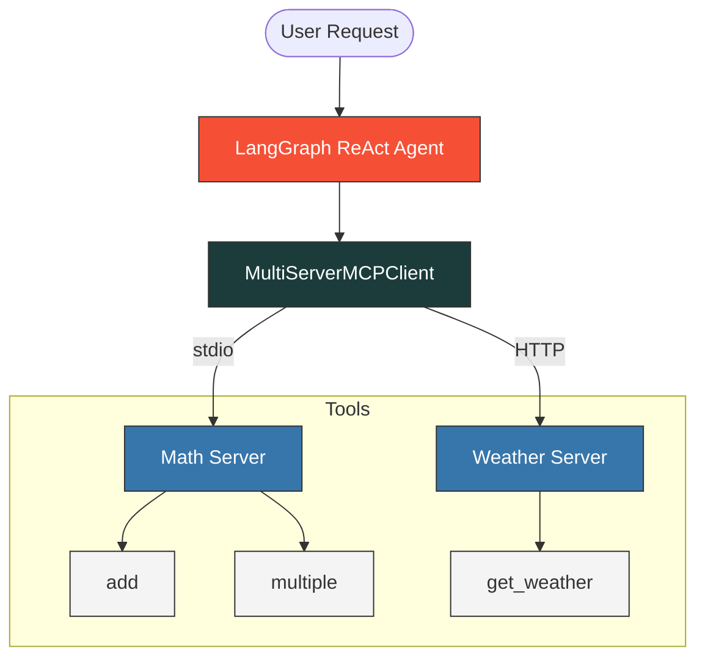

<div align="center">

# Multi-Server MCP Orchestrator

### LangChain & LangGraph Powered Intelligent Agent

[](https://python.org)
[](https://langchain.com)
[](https://modelcontextprotocol.io)
[](https://groq.com)

An agentic application that implements the Model Context Protocol (MCP) using LangChain and LangGraph to coordinate multiple local and remote tool servers. By leveraging ChatGroq (Llama 3.3), the system dynamically routes queries to resolve mathematical operations and fetch live weather data via hybrid transport protocols.

<br />

[](#how-it-works)
[](#getting-started)

</div>

---

## How It Works

This orchestrator binds independent FastMCP tool servers (running via stdio and HTTP transports) into a single, unified agentic workspace using the LangChain MCP Adapters.

<details>
<summary><b>View Runtime Architecture & Flow Diagram</b></summary>



</details>

## Key Features

- **Multi-Server Coordination** — Integrates multiple MCP tool servers concurrently under a single client adapter.
- **Dynamic Tool Calling** — A LangGraph ReAct agent discovers, plans, and invokes the most appropriate tool depending on the user's natural language input.
- **Hybrid Transport Modes** — Connects to local sub-processes via standard input/output (stdio) and remote/decoupled web servers via HTTP (streamable_http).
- **FastMCP Protocol Integration** — Servers are built with FastMCP, enabling declarative, type-safe Python decorator tools with automatically generated schemas.
- **Live Third-Party API Integration** — Retrieves geocoding details and weather forecasts dynamically from the Open-Meteo API.

## Tech Stack

<table>
  <thead>
    <tr>
      <th>Layer</th>
      <th>Technology</th>
      <th>Description</th>
    </tr>
  </thead>
  <tbody>
    <tr>
      <td><strong>Agent Loop</strong></td>
      <td>
        <a href="https://langchain.com">
          
        </a>
      </td>
      <td>State machine representation and ReAct design pattern implementation</td>
    </tr>
    <tr>
      <td><strong>MCP Integration</strong></td>
      <td>
        <a href="https://modelcontextprotocol.io">
          
        </a>
      </td>
      <td>Orchestration bridge between LangChain and Model Context Protocol</td>
    </tr>
    <tr>
      <td><strong>Inference Engine</strong></td>
      <td>
        <a href="https://groq.com">
          
        </a>
      </td>
      <td>LLM model for planning, routing, and structuring outputs</td>
    </tr>
    <tr>
      <td><strong>Server Framework</strong></td>
      <td>
        <a href="https://github.com/modelcontextprotocol/python-sdk">
          
        </a>
      </td>
      <td>Python SDK used to structure tools and host services</td>
    </tr>
    <tr>
      <td><strong>HTTP Client</strong></td>
      <td>
        <a href="https://www.python-httpx.org">
          
        </a>
      </td>
      <td>Asynchronous HTTP requests to external geocoding and forecast web services</td>
    </tr>
  </tbody>
</table>

## Project Structure

```
.
├── client.py              # Main client — configures adapter, builds LangGraph agent, runs queries
├── mathserver.py          # Math tool server (stdio transport: add, multiply tools)
├── weather.py             # Weather tool server (HTTP transport: geocoding & forecast tools)
├── pyproject.toml         # Python dependency definitions & project configuration (uv format)
├── requirements.txt       # Pip dependency definitions
├── .env                   # Environment secrets (GROQ_API_KEY)
└── .gitignore             # Version control exclusions
```

## Getting Started

### Prerequisites

- Python 3.13+
- A Groq API Key (get one from [console.groq.com](https://console.groq.com))

### Installation

```bash
# Clone the repository
git clone https://github.com/your-username/mcp-langchain.git
cd mcp-langchain

# Create and activate a virtual environment
python -m venv .venv
source .venv/bin/activate  # On Windows: venv\Scripts\activate

# Install dependencies using uv (recommended)
uv pip install -r requirements.txt
# Or using pip:
pip install -r requirements.txt
```

### Configuration

Create a `.env` file in the root of the project to configure your credentials:

```env
GROQ_API_KEY=your_groq_api_key_here
```

### Run the Application

Since the Weather Server communicates over HTTP (streamable_http), you must run it in a separate process before launching the main client:

1. **Start the Weather Server:**
   ```bash
   python weather.py
   ```
   This will start the server listening at `http://127.0.0.1:8000/mcp`.

2. **Run the Agent Client:**
   In another terminal (with the virtual environment activated):
   ```bash
   python client.py
   ```
   The client automatically spawns the Math Server via a child process (stdio transport) and connects to the running Weather Server over HTTP, queries the agent, and prints outputs for both math and weather operations.

## How the MCP Pipeline Works

<details>
<summary><b>View Detailed Pipeline Steps</b></summary>

### 1. Tool Discovery & Adapter Setup
`MultiServerMCPClient` initialized in [client.py](file:///Users/chokkaraketankumar/Desktop/MCP-Langchain/client.py) aggregates all tools declared in [mathserver.py](file:///Users/chokkaraketankumar/Desktop/MCP-Langchain/mathserver.py) (via subprocess) and [weather.py](file:///Users/chokkaraketankumar/Desktop/MCP-Langchain/weather.py) (via HTTP).

### 2. State-Based ReAct Agent Loop
LangGraph wraps the LangChain tools and ChatGroq model in a state-based loop:
1. **Model Step**: LLM decides if it needs a tool or can respond directly.
2. **Tool Execution**: If a tool is called, the execution is dispatched to the corresponding MCP server.
3. **Observation Step**: The tool results are fed back to the model state to form a final answer.

</details>

## Customization

The system is designed to be highly modular and extensible. You can adapt it to any set of services:

| Component | Target File | Modification Details |
|:---|:---|:---|
| **Add New Math Tools** | [mathserver.py](file:///Users/chokkaraketankumar/Desktop/MCP-Langchain/mathserver.py) | Define new decorated functions with the `@mcp.tool()` decorator |
| **New Integrations** | [client.py](file:///Users/chokkaraketankumar/Desktop/MCP-Langchain/client.py) | Register additional server endpoints inside the `MultiServerMCPClient` initialization map |
| **Different Model** | [client.py](file:///Users/chokkaraketankumar/Desktop/MCP-Langchain/client.py) | Replace the model parameter in `ChatGroq(...)` with other models |

## Acknowledgments

- [Model Context Protocol (MCP)](https://modelcontextprotocol.io) for standardizing application-tool interaction
- [LangChain](https://langchain.com) and [LangGraph](https://langchain-ai.github.io/langgraph/) for the execution state-machine frameworks
- [Open-Meteo](https://open-meteo.com) for their free geocoding and meteorological APIs

---
